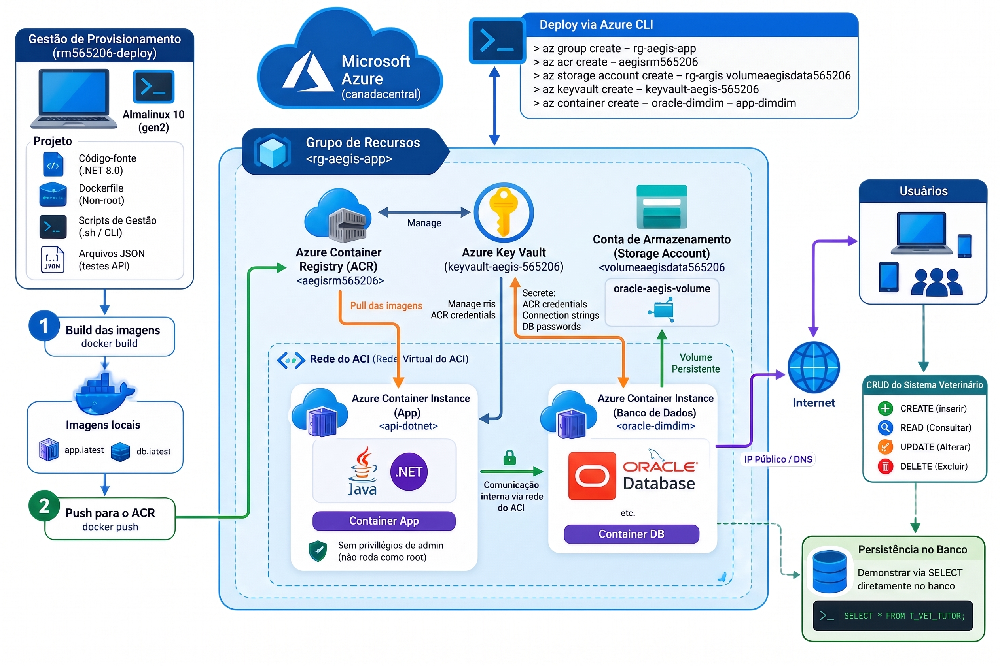

```markdown
# Sistema Veterinário | DevOps Tools & Cloud Computing

**Grupo:**
* Felipe Ribeiro Salles de Camargo | RM565224
* João Pedro Pereira Camilo | RM562005
* Lucas Matsubara Reis | RM565020
* Pamella Christiny Chaves Brito | RM565206

---

## 1. Descrição da Solução

O **Sistema Veterinário Aegis** é uma plataforma moderna desenvolvida em arquitetura limpa (Clean Architecture) com **.NET 8.0 na API** e **Oracle Database** para persistência de dados. A solução foi projetada para otimizar a gestão de clínicas e hospitais veterinários, centralizando o controle de cadastros de pacientes, tutores, prontuários médicos, agendamentos de consultas e histórico de tratamentos.

A aplicação adota uma abordagem conteinerizada utilizando **Docker**, orquestrada e hospedada nativamente na **Microsoft Azure**.

---

## 2. Benefícios para o Negócio

* **Resiliência e Escalabilidade Dinâmica:** Uso do **Azure Container Instances (ACI)** e **Azure Container Registry (ACR)**, permitindo escalar a API instantaneamente.
* **Isolamento de Carga Crítica:** O banco Oracle XE é isolado com volume persistente (**Azure Files / Storage Account**), garantindo integridade das transações.
* **Segurança da Informação (Non-Root):** Aplicação .NET empacotada executando sob um usuário restrito, em conformidade com as melhores práticas de segurança.
* **Gestão Centralizada de Segredos:** O **Azure Key Vault** elimina o armazenamento de credenciais e senhas em texto plano no código-fonte.

---

## 3. Arquitetura da Solução



**Fluxo:**
1. A infraestrutura é criada via Azure CLI (Cloud Shell).
2. O código é compilado em imagens Docker (API e Banco) e enviado ao **ACR**.
3. O **Key Vault** guarda as senhas e as entrega com segurança.
4. O banco Oracle roda em um **ACI** conectado a um **Storage Account** para não perder dados.
5. A API .NET roda em outro **ACI** conectado ao banco de dados.

---

## 4. GUIA PASSO A PASSO ("HOW TO" COMPLETO)

Siga este passo a passo atentamente. Preste muita atenção aos avisos de **onde** você deve digitar os comandos.

### FASE 1: O Início no Cloud Shell (A tela do navegador)
> **ONDE ESTOU?** 👉 No portal do Azure, clique no ícone `>_` (Cloud Shell) no topo da tela. Escolha a opção "Bash".

**Passo 1:** Garanta que você está logado na conta certa da Azure:
```bash
az account show

```

*(Se der erro ou não mostrar seus dados, digite `az login` e siga os passos na tela).*

**Passo 2:** Baixe o seu projeto para dentro do Cloud Shell:

```bash
cd ~
git clone [https://github.com/Portifolio-Pamella/Challenge-Cloud-Devops.git](https://github.com/Portifolio-Pamella/Challenge-Cloud-Devops.git)
cd Challenge-Cloud-Devops/scripts-azure
chmod +x *.sh

```

**Passo 3:** Execute os scripts de infraestrutura, um por um. Espere um terminar para rodar o próximo:

```bash
./01_azure_vm_conteiners.sh
./01_2_configurar_vm.sh
./01_5_create_acr.sh
./02_storage_account.sh
./03_key_vault.sh

```

---

### FASE 2: Preparando para entrar na Máquina Virtual

> **ONDE ESTOU?** 👉 Ainda no Cloud Shell! Não entre na VM ainda.

Antes de entrarmos na Máquina Virtual, precisamos de **duas coisas anotadas num Bloco de Notas** no seu computador:

**1. O IP da sua Máquina Virtual:**
Rode este comando para descobrir qual é o IP dela e copie o número que aparecer:

```bash
az vm show -d -g rm565206-infra -n rm565206-deploy --query publicIps -o tsv

```

**2. A Senha do Docker (ACR):**
Rode este comando para revelar a senha do seu cofre de imagens. Copie esse código gigante que vai aparecer:

```bash
az acr credential show -n aegisrm565206 --query "passwords[0].value" -o tsv

```

---

### FASE 3: O Build dentro da Máquina Virtual

> **ONDE ESTOU?** 👉 Agora vamos "entrar" na VM. No Cloud Shell, digite o comando abaixo usando o IP que você anotou:

**Passo 1: Entrar na VM**

```bash
ssh admlnx@<COLE_O_IP_AQUI>

```

*(Ele vai pedir a senha. Digite a senha padrão da faculdade que você configurou na criação. Lembre-se: nada aparece na tela enquanto você digita).*

**Passo 2: Baixar o código DENTRO da VM**
Quando o terminal mudar de nome para `[admlnx@rm565206-deploy]`, digite:

```bash
git clone [https://github.com/Portifolio-Pamella/Challenge-Cloud-Devops.git](https://github.com/Portifolio-Pamella/Challenge-Cloud-Devops.git)
cd Challenge-Cloud-Devops/sistema-veterinario-dotnet

```

*(Dica: Se ele pedir senha do GitHub no clone, use aquele **Token (PAT)** que você gerou no site do GitHub, e não a senha da sua conta).*

**Passo 3: Fazer o Login no Docker**
Agora, faça o login usando aquela senha gigante do ACR que você anotou no Bloco de Notas:

```bash
sudo docker login aegisrm565206.azurecr.io -u aegisrm565206

```

*(Cole a senha gigante e dê Enter).*

**Passo 4: Criar e Enviar a imagem da API**

```bash
sudo docker build -t aegisrm565206.azurecr.io/rm565206-api:v1 .
sudo docker push aegisrm565206.azurecr.io/rm565206-api:v1

```

**Passo 5: Criar e Enviar a imagem do Banco de Dados Oracle**

```bash
sudo docker build -f Dockerfile-db -t aegisrm565206.azurecr.io/rm565206-db:v1 .
sudo docker push aegisrm565206.azurecr.io/rm565206-db:v1

```

**Passo 6: SAIR da Máquina Virtual**
Acabamos o trabalho aqui dentro. Vamos voltar para o Cloud Shell:

```bash
exit

```

---

### FASE 4: O Deploy Final (Voltando pro Cloud Shell)

> **ONDE ESTOU?** 👉 Você digitou `exit`, então voltou para o Cloud Shell inicial.

**Passo 1:** Volte para a pasta dos seus scripts:

```bash
cd ~/Challenge-Cloud-Devops/scripts-azure

```

**Passo 2:** Rode o script que cria o Container do Banco de Dados:

```bash
./04_deploy_oracle_aci.sh

```

**Passo 3:** Rode o script que cria o Container da API (já se conectando ao banco):

```bash
./05_deploy_api_aci.sh

```

🎉 **SUCESSO!** O terminal mostrará o link HTTP da sua API no final. É só clicar e testar!

```

Com essa estrutura, qualquer pessoa (especialmente os professores avaliadores) vai saber com clareza cristalina quando usar o ambiente Azure, quando entrar na VM, quando sair dela e quais senhas devem ser copiadas previamente!

```